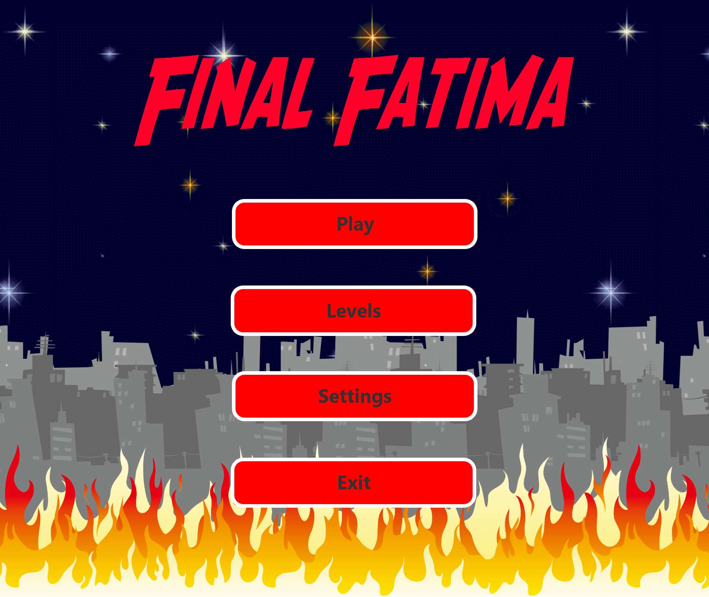
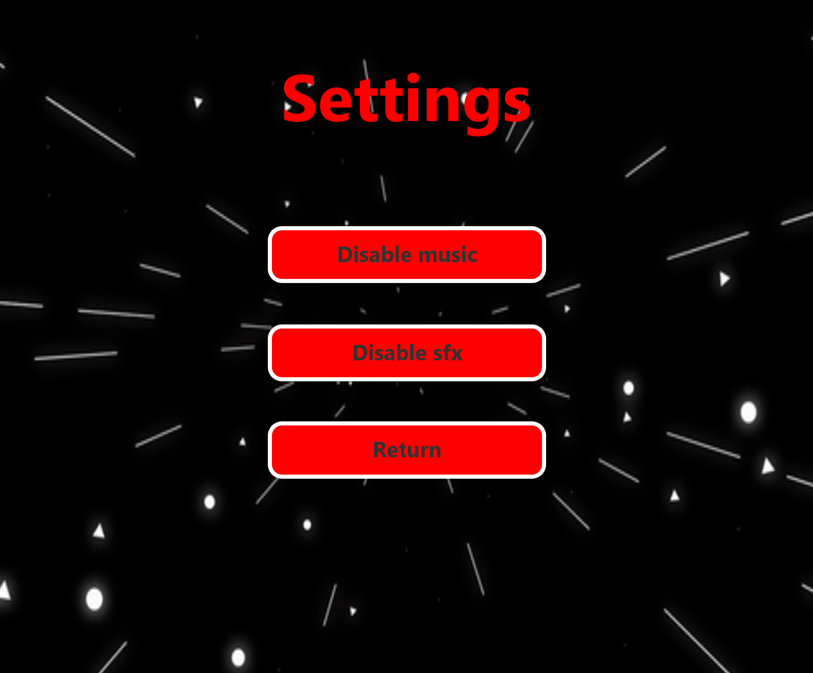
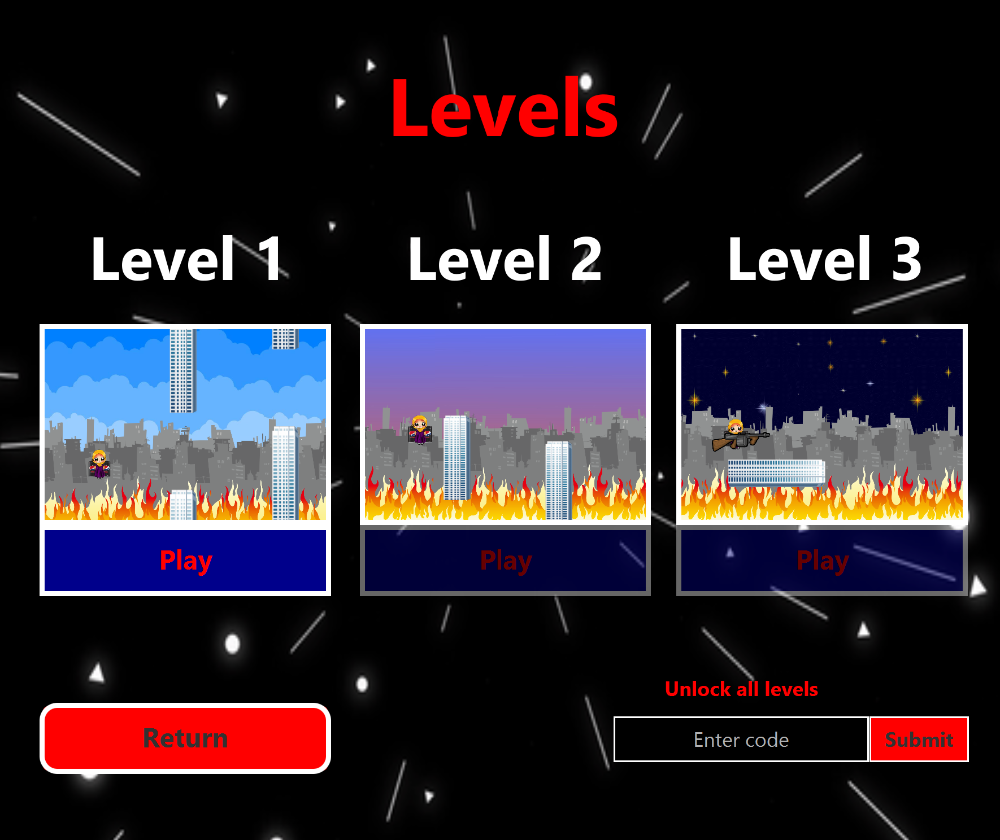
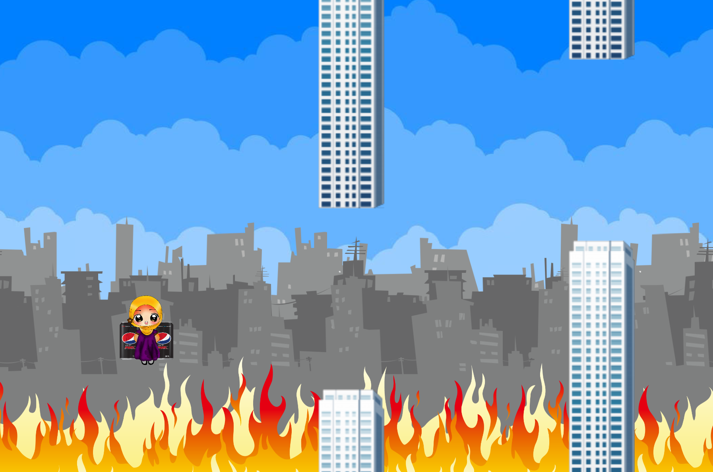

## Final Fatima - An Adventure Game

Tölvuleikur búinn til í JavaFX sem lokaverkefni fyrir áfangann Viðmótsforritun hjá Haskóla Íslands.

## Game Prologue

Oh no, the city is in panic! skyscrapers are flying and destruction is everywhere. Apparently a super soldier experiment funded by the pepsi factory has gone wrong. They fed a man nothing but liters of pepsi everyday to give him superpowers and their plan worked too well, now he has awakened god level abilities including anti gravity powers and he's making the city's skyscrapers rip from the ground and fly all over the place, and his abilities are only growing stronger by the minute. One worker at the pepsi factory by the name of Fatima has taken it upon herself to stop this newly awakened menace. She has built a flying contraption that utilizes the lower state of gravity and pepsi-max to allow her to gain flight. Using this she intends to acquire a weapon left behind by the helicopter men on one of the floating buildings in the city. But before she can get to it she has to practice her flying. Click \"continue\" to follow Fatima at the start of her fateful journey. Use the UP-arrow key to fly-jump in order to avoid the obstacles. The progress bar at the bottom always shows your distance from the current objective.

## Manual

Þegar leikurinn er keyrður kemur fyrst menu screen sem gefur valmöguleika varðandi hvert á að fara.

Þar er hægt að velja settings sem gefur upp valmöguleika um að slökkva á tónlist eða hljóði.

Það er líka hægt að velja "Levels" sem leyfir manni að velja hvaða borð í leiknum á að fara í. Það er bara hægt að velja borð sem búið er að klára núþegar.

Svo til að spila leikinn þarf einfaldlega að ýta á "Play" og þá er byrjað leikinn.

## Controls

Aðal skipaninar til að spila leikinn er "up-arrow" takkinn til að fljúga upp og svo "s" takkinn til að skjóta. Meira þarf ekki.

## Keyrsla

Til að keyra verkefnið þarf að hafa Java uppsett á tölvunni og svo er nóg að klóna repo'ið og svo keyra GameApplication.java skránna staðsetta í src/main/java/hi.verkefni/vidmot. Þar sem leikurinn var gerður með IntelliJ uppsetningu fyrir JavaFX er best að nota það til að keyra verkefnið locally.

### Disclaimer

Leikurinn er ekki gerður fyrir "commercial" notkun og er þannig öll tónlist og hljóð notuð aðeins í áhugasömum tilgangi.